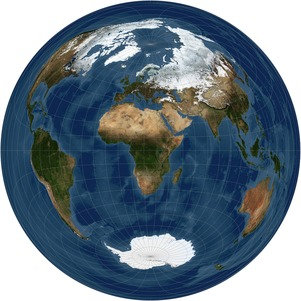
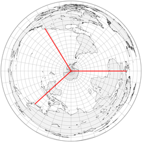
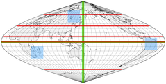
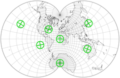

 
根据兰伯特方位等积投影的赤道形式呈现的世界。未投影的原始卫星数据由NASA提供

**总结**

关于地图投影的分类，已有多种不同的方法。大多数分类是正交的，因此任何单个投影可能同时属于不同类别。在其他分类方法中，如受生物学启发的毛雷尔分类法，则采用了分支分类体系。

请注意，为便于定义和可视化，下文将根据经纬网对某些类别和投影进行非正式描述，因此某些特性可能看似依赖于地图所使用的特定投影方向。例如，圆柱投影中的坐标线在赤道投影中正交，但在极地或斜轴投影中则不正交，尽管所有其他属性仍然保持；毕竟，坐标网格只是一组常规线条。

**按几何特征分类的投影**

| 类别 | 特征 |
|------|------|
| 方位投影 | 亦称天顶投影。显示从单个点出发的真实方向（方位角）；在极地方位中，所有纬线为圆形，经线为直线，等距分布且汇聚于一点；未裁剪的世界地图为圆盘形。 |
| 圆柱投影 | 类比于圆柱作为中间投影面而定义；在赤道投影中，所有纬线和经线均为直线；经线与纬线正交且等距分布；未裁剪的世界地图为矩形。 |
| 圆锥投影 | 类比于圆锥作为中间投影面；在极地投影中，所有纬线为同心圆弧，经线为垂直于每条纬线的直线，等距分布且间距小于地球上的实际间距；未裁剪的地图为扇形或圆环形。 |
| 伪圆柱投影 | 在赤道投影中，所有纬线为平行的直线；经线为任意曲线，沿每条纬线等距分布。 |
| 伪圆锥投影 | 在极地投影中，所有纬线为同心圆弧，经线为任意曲线。 |
| 任意投影或折衷投影 | 经纬线为任意曲线；通常无纯粹的几何构造定义。有些作者将任何非源自几何方法、而是为特定目的量身定制的投影称为"任意"、"常规"或"折衷"投影。 |

从某种意义上说，圆锥作为极端情况包括圆柱（顶点在无穷远处的圆锥）和平面（高度为零的圆锥）。因此，圆锥投影组概括了方位投影和圆柱投影，并在广义上包括了伪圆柱和伪圆锥投影。此外，有些人认为多圆锥投影组包括那些纬线源自圆形的投影，包括改良的方位投影，如哈默投影和艾托夫投影。实际上，许多所谓的"方位"、"圆锥"或"圆柱"投影并非基于纯粹的几何体投影过程构建，而是由于映射坐标网格的几何特性而被如此分类。

此外，投影式、几何式或透视式投影可以精确类比于将原始表面连接到地图表面的光线几何设置。有些作者将其他投影称为"数学投影"。

<table>
<tr>
    左侧:
</td>
    右上:
</td>
   右下:
</td>
</tr>
</table>

在方位投影中，从投影中心（可能与地图中心重合，也可能不重合）辐射出的直线之间的角度，与地球上对应线之间的角度相同。在左侧的方位等距地图上，沿这些线的距离也与地球上的距离成正比。
在等积正弦曲线地图（右上）上，对于任意两个相同的边界（如蓝色方块），其在地球上的对应部分将围成相同的面积，尽管它们不一定具有相同的形状。该伪圆柱投影仅沿两条轴线（绿色）保持角度不变；它仅沿这些轴线和所有垂直于短轴的线（红色）保持等距。
与几乎所有其他等角投影不同，艾森洛尔投影（右下）在每个点都保持小角度不变：绿色线在地球和地图上均垂直。面积和距离变形较大，但小于典型的等角投影。

**按属性特征分类的投影**

| 类别 | 特征 |
|------|------|
| 等积投影 | 地图上任何区域的面积与球面上对应区域的面积成正比；亦称等面积或等积。通常更适用于统计比较和教学目的。 |
| 等距投影 | 在地图上存在两组点A和B，使得沿选定的线集（不一定是直线），从A中任一点到B中另一点的距离与球面上对应点之间沿这些对应线的距离成正比。换言之，在这些线上比例尺恒定，这些线称为标准线。大多数投影都有这样的线集，但很少有投影真正被称为"等距"投影。 |
| 等角投影 | 在地图上任何*小区域内，两条相交线与球面上对应线具有相同的角度，因此形状在局部得以保持。亦称正形或保角。对于导航目的和大比例尺制图最为重要，尤其是在椭球体情况下。 |
| *在几乎所有等角投影中，至少有一个点（常选极点）要么无法表示，要么不满足等角性。 |
| 非等性投影 | 有些作者用此名称指那些既不等角也不等积的投影。 |

**投影概览**

下文所列投影均有更详细的描述。这只是现有设计中的一小部分样本，未必是最重要或最常用的；因此，选择必然带有主观性。同样主观的是，改变投影方向或其他细节是否足以将其单独列为一个条目（例如，卡西尼投影与等距圆柱投影、高斯横轴投影与墨卡托投影、彼得曼投影与贝格豪斯投影之间的区别）。

**投影概览**

下表所列投影均有更详细的描述。这只是现有设计中的一小部分样本，未必是最重要或最常用的；因此，选择必然带有主观性。同样主观的是，改变投影方向或其他细节是否足以将其单独列为一个条目（例如，卡西尼投影与等距圆柱投影、高斯横轴投影与墨卡托投影、彼得曼投影与贝格豪斯投影之间的区别）。

| 样图 | 常用名称 | 主要特征 |
|------|----------|----------|
|  ./asserts/image_1625495523294_0.png| 方位正交投影、正交投影 | 方位投影，从无限远处太空观察地球的"真实"视图。最多显示一个半球 |
|  ./asserts/image_1625495665448_0.png| 方位球面投影、球面投影 | 方位投影，等角，保持所有圆形；最多显示一个半球 |
| ./asserts/image_1625495786822_0.png | 日晷投影、中心投影、心射投影、日晷 | 方位投影，所有大圆映射为直线；远离中心处变形剧烈；显示少于一个半球 |
| /asserts/image_1625495900262_0.png | 广义垂直透视投影 | 方位投影，正交、球面、日晷等方位投影的一般形式。从太空直视地球中心的最真实视角。由投影中心距离参数化；特殊情形包括拉伊尔、帕朗、洛瑞、费舍尔、格雷切尔、詹姆斯、克拉克（"暮光"）等人提出的投影 |
| ./asserts/image_1635064632094_0.png | 方位等距投影、天顶等距投影 | 非透视方位投影，沿任何通过地图中心的线保持距离不变 |
|./asserts/image_1635064685244_0.png  | 兰伯特方位等积投影 | 非透视。唯一的方位等积投影 |
|  ./asserts/image_1635064736136_0.png| 金兹堡方位投影 I 和 II | 非透视，既不等积也不等角 |
|  ./asserts/image_1635064790472_0.png| 兰伯特等积圆柱投影；贝赫曼、特赖斯坦·爱德华兹、高尔（正交）、彼得斯、戴尔、托布勒/陈的变体 | 唯一可能的圆柱等积投影，包括高尔（"彼得斯"）和霍博-戴尔等仅标准纬线不同的缩放变体 |
|./asserts/image_1635064849639_0.png  | 高尔球面圆柱投影 | 既不等角也不等积。变体包括布劳恩球面圆柱投影和BSAM圆柱投影 |
| ./asserts/image_1635064924762_0.png | 布劳恩球面圆柱投影 | 既不等角也不等积，是高乐球面圆柱投影的特例 |
| ./asserts/image_1635065042155_0.png | 中央圆柱投影 | 既不等角也不等积；勿与墨卡托投影混淆。横轴形态为韦奇投影 |
| /asserts/image_1635065099108_0.png | 等距圆柱投影、等矩形圆柱投影、平面海图；特例包括简单圆柱投影（普拉特卡雷）、高尔等视投影和卡西尼投影 | 圆柱投影，计算非常快速简便，既不等角也不等积；最常见情况下映射为纵横比2:1（宽度为高度两倍）的矩形 |
|  ./asserts/image_1635065189728_0.png| 卡西尼投影 | 普拉特卡雷投影的横轴形态 |
| /asserts/image_1635065236596_0.png | 高尔等视投影 | 等距圆柱投影的特例，标准纬线45°N和45°S |
| ./asserts/image_1635065291885_0.png | 墨卡托投影、圆柱等角投影；横轴椭球体形式称为高斯等角投影或高斯-克吕格投影 | 唯一可能的等角圆柱投影；横轴形态是UTM网格的基础 |
| ./asserts/image_1635065373674_0.png | 米勒投影 | 圆柱投影，对墨卡托投影的任意折衷；既不等积也不等角 |
| ./asserts/image_1635065485454_0.png | 梯形投影、多尼斯投影 | 伪圆柱投影，经线为直线，有时在赤道处对称断裂 |
| ./asserts/image_1635065514495_0.png | 摩尔魏特投影、椭圆投影、巴比涅投影、等积投影、同积投影 | 伪圆柱投影，等积，经线为椭圆；完整地图以2:1椭圆为边界；有时采用中断形式；变体包括亚特兰蒂斯投影和布罗姆利投影 |
| ./asserts/image_1635065569659_0.png | 正弦曲线投影、桑森-弗拉姆斯蒂德投影、墨卡托等积投影 | 伪圆柱投影，等积，经线为正弦曲线，纬线等距且为标准线；2:1 |
| /asserts/image_1635065593319_0.png | 傅科球面等积投影 | 伪圆柱投影，等积，纬线间距与方位球面投影的赤道视角相同 |
|  ./asserts/image_1635065619288_0.png| 科利尼翁投影 | 伪圆柱投影，等积，经线为直线。两种主要变体：三角形框架或对称菱形，经线在赤道处断裂 |
| ./asserts/image_1635065646009_0.png | 克拉斯特抛物线投影 | 伪圆柱投影，等积，经线为抛物线。与普廷什P4投影相同 |
|  ./asserts/image_1635065670312_0.png| 等角航线投影 | 伪圆柱投影，所有通过中央经线与参考纬线交点的直线均为等角航线，具有正确的比例尺和方位角。通常关于赤道不对称 |
| ./asserts/image_1635065699673_0.png | 四次等积投影 | 伪圆柱投影，等积，经线为四次多项式；哈默投影和埃克特-格里芬多夫投影的极限情况 |
| ./asserts/image_1635065727199_0.png | 平极四次投影 | 伪圆柱投影，等积，极线长度为赤道的1/3 |
| ./asserts/image_1635065757606_0.png | 内尔伪圆柱投影 | 伪圆柱投影，等积，有极线 |
| ./asserts/image_1635065784847_0.png | 内尔-哈默投影 | 伪圆柱投影，等积，有极线 |
| ./asserts/image_1635065815609_0.png | 埃克特 I | 伪圆柱投影，2:1，极线长度为赤道的一半，经线为直线，在赤道处断裂。纬线等距 |
|./asserts/image_1635065848888_0.png  | 埃克特 II | 伪圆柱投影，等积，2:1，极线长度为赤道的一半，经线为直线，在赤道处断裂 |
|./asserts/image_1635065879426_0.png  | 埃克特 III | 伪圆柱投影，2:1，经线为椭圆弧（边界为圆形）。纬线等距 |
| ./asserts/image_1635065904798_0.png | 埃克特 IV | 伪圆柱投影，等积，2:1，经线为椭圆弧，边界处为圆形 |
|./asserts/image_1635065928055_0.png  | 埃克特 V | 伪圆柱投影，2:1，经线为正弦曲线，纬线等距。温克尔第一投影的特例 |
| ./asserts/image_1635065954593_0.png | 埃克特 VI | 伪圆柱投影，等积，2:1，极线长度为赤道的一半，经线为正弦曲线 |
|  ./asserts/image_1635065981727_0.png| 罗森伪圆柱投影 | 伪圆柱投影，等积，基于正弦曲线投影：极点映射至基础投影的arcsin(0.8) N和S纬线 |
| ./asserts/image_1635066007040_0.png | 罗宾逊投影、正形投影 | 伪圆柱投影，折衷设计。既不等角也不等积 |
|  ./asserts/image_1635066031094_0.png| 卡夫拉伊斯基 V | 伪圆柱投影，等积 |
|  ./asserts/image_1635066058277_0.png| 卡夫拉伊斯基 VII | 伪圆柱投影，折衷设计，经线为椭圆 |
| ./asserts/image_1635066085468_0.png | 古德等积投影 | 伪圆柱投影，等积，结合了极区的摩尔魏特投影和赤道带的桑森-弗拉姆斯蒂德投影，几乎总是采用中断形式 |
| ./asserts/image_1635066110923_0.png | 博格斯等形投影 | 伪圆柱投影，等积，是摩尔魏特投影和桑森-弗拉姆斯蒂德投影的算术平均。通常采用中断形式 |
| ./asserts/image_1635066138581_0.png | 正弦-摩尔魏特投影 | 伪圆柱投影，等积，融合了摩尔魏特投影和（下半部分的）桑森-弗拉姆斯蒂德投影。通常采用斜轴和中断形式 |
| ./asserts/image_1635066187633_0.png | 温克尔 I | 伪圆柱投影（推广了埃克特 V），平均了桑森-弗拉姆斯蒂德投影和等距圆柱投影，经线为正弦曲线 |
|  ./asserts/image_1635066210773_0.png| 温克尔 II | 伪圆柱投影，平均了等距圆柱投影和一种改进的椭圆投影 |
| ./asserts/image_1635066239757_0.png | HEALPix | 伪圆柱投影，等积，结合了兰伯特等积圆柱投影和中断的科利尼翁投影；设计用于FITS网格中天文和宇宙学数据的栅格处理 |
|./asserts/image_1635066267638_0.png  | 伪埃克特投影 | 伪圆柱投影，等积，经线为部分正弦曲线 |
|  ./asserts/image_1635066289379_0.png| 透视圆锥投影（正交、球面或心射） | 圆锥投影，真正的透视投影。默多克和科尔斯使用 |
| ./asserts/image_1635066521768_0.png | 等距圆锥投影 | 圆锥投影，经线比例尺恒定；极限情况为方位等距投影和圆柱等距投影。舍尔宁第一投影的一般形式。有多种变体，主要区别在于标准纬线的选择（默多克、欧拉）；其他包括德利勒的类圆锥投影 |
|./asserts/image_1635066558532_0.png  | 布劳恩球面圆锥投影 | 透视圆锥投影，投影中心位于极点，标准纬线30° |
| ./asserts/image_1635066580964_0.png | 阿尔伯斯等积圆锥投影 | 圆锥投影，等积；极限情况为兰伯特等积圆锥投影和圆柱投影 |
| ./asserts/image_1635066603047_0.png | 兰伯特等积圆锥投影、等球狭窄投影 | 圆锥投影，等积；阿尔伯斯圆锥投影的极限情况，以极点作为标准纬线 |
| ./asserts/image_1635066636953_0.png | 兰伯特等角圆锥投影、正形圆锥投影 | 圆锥投影，等角；极限情况为方位球面投影和墨卡托投影 |
|./asserts/image_1635066661394_0.png  | 多圆锥投影、美国多圆锥投影 | 多圆锥投影，纬线为非同心圆弧，具有正确比例尺。既不等角也不等积 |
| ./asserts/image_1635066689808_0.png | 矩形多圆锥投影、陆军部投影 | 多圆锥投影，纬线为非同心圆弧，与所有经线正交；赤道或两条纬线具有正确长度。既不等积也不等角 |
| ./asserts/image_1635066757906_0.png | 维歇尔投影 | 伪方位投影；改进的方位等积投影，不再具有方位性。仅在极地视角中有趣，此时经线为标准比例尺的圆弧。通常限于单个半球 |
|./asserts/image_1635066789538_0.png  | 艾托夫投影 | 拉伸改进的赤道方位等距地图；边界为2:1椭圆；既不等积也不等角 |
| ./asserts/image_1635066816959_0.png | 哈默投影、哈默-艾托夫投影、艾托夫-哈默投影 | 由赤道方位等积投影改进而来；等积，边界为2:1椭圆；变体包括布里塞迈斯特投影、海洋投影和北欧投影 |
| ./asserts/image_1635066849554_0.png | 布里塞迈斯特投影 | 重新缩放的斜轴哈默投影。等积 |
| ./asserts/image_1635066906135_0.png | 埃克特-格里芬多夫投影 | 类似于哈默投影，但缩放因子不同，因此纬线近乎直线。等积 |
| ./asserts/image_1635066928187_0.png | 舍尔宁第二投影（原始地图包含一个未指定的任意放大区域） | 内半球为方位等距投影。外半球构成2:1椭圆。距地图中心距离正确，但仅内半球方位角正确。既不等角也不等积 |
| ./asserts/image_1635066967654_0.png | 舍尔宁第三投影 | 地图由两个在一点相交的圆形组成。地图上每一点到中心的距离正确，但方位角不正确。最终地图以伦敦为中心。既不等角也不等积 |
| ./asserts/image_1635066994225_0.png | 瓦格纳第九投影、艾托夫-瓦格纳投影 | 改进的艾托夫投影；既不等积也不等角 |
| ./asserts/image_1635067020040_0.png | 温克尔三重投影 | 艾托夫投影和等距圆柱投影的算术平均。既不等积也不等角 |
|./asserts/image_1635067045550_0.png  | 斯托布斯-维尔纳第一投影 | 伪圆锥投影，等积，纬线为以极点为中心的等距圆弧 |
| ./asserts/image_1635067067576_0.png | 维尔纳投影、斯托布斯-维尔纳第二投影、心形投影 | 伪圆锥投影，等积，纬线为以极点为中心的等距圆弧且为标准线。舍尔宁第四投影为斜轴形态；舍尔宁第五投影纬线缩短；舍尔宁第六投影采用中断形式 |
| ./asserts/image_1635067093148_0.png | 斯托布斯-维尔纳第三投影 | 伪圆锥投影，等积，纬线为以极点为中心的等距圆弧 |
|  ./asserts/image_1635067137875_0.png| "彭纳"投影 | 伪圆锥投影，等积，纬线为等距圆弧且为标准线。外观取决于参考纬线。是维尔纳投影和正弦曲线投影的一般形式 |
| ./asserts/image_1635067161327_0.png | "拉格朗日"投影 | 经线和纬线均为圆弧，仅中央经线和一条基准纬线为直线。除极点外处处等角。由兰伯特发展的基础情形为圆形 |
| ./asserts/image_1635067186431_0.png | 德卢西亚/斯奈德对吉尔伯特等角双球球体的正交投影 | 经纬网由椭圆弧构成。既不等角也不等积 |
| ./asserts/image_1635067209206_0.png | 皮尔斯五点梅花形投影 | 正方形世界地图，中心半球位于内正方形。除边缘中点外处处等角。古约和亚当斯提出其他形态 |
| ./asserts/image_1635067246045_0.png | 古约投影 | 2:1矩形世界地图。除半球角点外处处等角。皮尔斯和亚当斯提出其他形态 |
| ./asserts/image_1635067268145_0.png | 亚当斯/古约投影 | 两个正方形中的半球。除正方形角点外处处等角。古约和皮尔斯提出其他形态 |
| ./asserts/image_1635067295078_0.png | 亚当斯1929投影 | 正方形世界地图（1929）。极点位于对角顶点；赤道沿对角线。除四个顶点外处处等角 |
|./asserts/image_1635067316939_0.png  | 亚当斯1936投影 | 正方形世界地图（1936）。极点位于对边中点。除极点和四个顶点外处处等角 |
| ./asserts/image_1635067346738_0.png | 哈拉克斯投影 | 半六边形中的世界地图。李的四面体地图的三瓣重组。除三条最长边的中点外处处等角 |
| ./asserts/image_1635067366546_0.png | 艾森洛尔投影 | 完全等角，无奇点。沿边界比例尺恒定。等角设计中比例尺变形范围最优 |
| ./asserts/image_1635067387488_0.png | 奥古斯特投影、奥古斯特圆外摆线投影 | 处处等角，无奇点。地图以圆外摆线为边界。斯皮尔豪斯部分海洋地图的基础 |
| ./asserts/image_1635067411525_0.png | 范德格林滕第一投影、范德格林滕 I | 边界为圆形，除中央经线和赤道外，经线和纬线均为圆弧。不等角，远离赤道处面积变形显著 |
| ./asserts/image_1635067436653_0.png | 范德格林滕第二投影、范德格林滕 II | 边界为圆形，经线和纬线为圆弧且正交；中央经线和赤道为直线。既不等积也不等角 |
| ./asserts/image_1635067466669_0.png | 范德格林滕第三投影、范德格林滕 III | 边界为圆形，经线为圆弧；水平纬线为直线，与中央经线相交于范德格林滕第一投影的相同点。既不等角也不等积 |
| ./asserts/image_1635067489571_0.png | 范德格林滕第四投影、范德格林滕 IV | 以两个相交圆为边界，经线为沿赤道等距分布的圆弧，纬线为圆弧。既不等角也不等积 |
|./asserts/image_1635067513321_0.png  | 毛雷尔全球状投影 | 经线沿范德格林滕第四投影的线分布，外部经线以半圆为边界。纬线为圆弧，在外部经线和赤道上等距分布 |
| ./asserts/image_1635067538198_0.png | 培根球状投影 | 单个半球，以圆形为边界。经线为圆弧；水平纬线为直线，沿半球边界等距。既不等角也不等积 |
|./asserts/image_1635067567137_0.png  | 阿皮安第一球状投影 | 单个半球，以圆形为边界。经线为圆弧；水平纬线为直线，沿中央经线等距。既不等角也不等积。奥特柳斯和阿尼塞加以扩展 |
| ./asserts/image_1635067587901_0.png | 阿皮安第二球状投影 | 单个半球，以圆形为边界。经线为椭圆弧；水平纬线为直线，沿中央经线等距。既不等角也不等积 |
| ./asserts/image_1635067615209_0.png | 富尼耶第一球状投影 | 单个半球，以圆形为边界。经线为椭圆弧；纬线为圆弧。既不等角也不等积 |
| ./asserts/image_1635067636176_0.png | 富尼耶第二球状投影 | 单个半球，以圆形为边界。经线为椭圆弧；纬线为直线。既不等角也不等积 |
| ./asserts/image_1635067669041_0.png | 尼科洛西球状投影、"尼科洛西"球状投影 | 单个半球，以圆形为边界。纬线和经线均为圆弧。既不等角也不等积。亦归功于拉伊尔和比鲁尼 |
| ./asserts/image_1635067702477_0.png | 奥特柳斯卵形投影 | 阿皮安第一球状半球的简单扩展。既非伪圆柱投影，也非等积或等角 |
| ./asserts/image_1635067729930_0.png | 列奥纳多·达·芬奇八分圆地图 | 八分圆地图，以圆弧为边界；经纬网不确定，可能既不等角也不等积 |
| ./asserts/image_1635067757198_0.png | 耶格星形投影 | 经纬网仅由直线构成。八个大小不等的瓣区，每个在内半球和外半球对称。每个瓣区内纬线线性间隔。既不等角也不等积 |
| ./asserts/image_1635067784609_0.png | 彼得曼星形投影 | 纬线为同心等距圆弧，经线为直线（多数在赤道处断裂）。既不等角也不等积。有时描述为大小不等的瓣区 |
| ./asserts/image_1635067812150_0.png | 贝格豪斯星形投影 | 彼得曼投影的五瓣版本 |
|./asserts/image_1635067834432_0.png  | 毛雷尔 S233 | 经纬网由直线构成，等间距。既不等角也不等积。耶格投影的对称情形 |
| ./asserts/image_1635067868337_0.png | 毛雷尔 S231（等积星形投影） | 纬线为同心圆弧；中心半球为兰伯特方位投影。瓣区经线为曲线。等积 |
| ./asserts/image_1635067893888_0.png | 威廉-奥尔森投影 | 结合了部分内半球的兰伯特方位投影和采用缩放维尔纳投影的瓣区。等积 |
| ./asserts/image_1635067921026_0.png | 巴塞洛缪"四面体"投影 | 核心为部分方位等距半球。瓣区为扩展纬线比例尺的改进维尔纳地图。既不等角也不等积，亦非多面体投影 |
| ./asserts/image_1635067942626_0.png | "花瓣"投影、雏菊投影 | 横轴墨卡托投影瓣区；中心核心采用方位等积投影。美国地质调查局ISIS软件包的一部分 |
|  ./asserts/image_1635067966639_0.png| 圆锥星形投影 | 与贝格豪斯投影非常相似，但中心半球基于等距圆锥投影；勿与卡希尔的"蝶形"地图混淆 |
| ./asserts/image_1635067992909_0.png | 犰狳投影（圆环面正交球状投影） | 中间投影面为半径为1和1的圆环面；最终地图通过正射投影得到；既不等积也不等角 |
| ./asserts/image_1635068015275_0.png | 半椭球体投影（椭球面正交球状投影） | 中间投影面为椭球体；极点可为点或线，经线可选择比例尺恒定；最终地图通过正射投影得到 |
|  | 阿登-克洛斯投影 | 等积圆柱投影与其横轴形态的算术平均；既不等积也不等角 |
|  | 托布勒局部地图投影 | 适用于小区域的快速渲染投影。既不等积也不等角。以参考纬线为参数 |
|  | 格林戈尔滕投影 | 正方形上的等积投影 |
|  | 李四面体投影 | 正四面体上的地图。除四面体顶点外处处等角 |
|  | COBE QSC、COBE球面四边形分割立方 | 立方体投影，近似等积。用于宇宙学天体图，而非地球地理 |
|  | QSC、球面四边形分割立方 | 立方体投影，等积。对COBE QSC的改进 |
|  | 富勒立方八面体投影 | 富勒立方八面体上的Dymaxion™投影。沿面边缘比例尺保持不变。既不等积也不等角。有多种面片排列方式 |
|  | 富勒Dymaxion投影 | 二十面体上的富勒Dymaxion™陆海世界地图。沿面边缘比例尺保持不变。既不等积也不等角。有多种面片排列方式 |
|  | 多面体日晷投影 | 多位作者采用的多面体日晷投影， notably Irving Fisher on the icosahedron and Cahill on octahedra 与普通日晷投影相同，具有中断投影的优点和缺点，加上任意面片排列 |
|  | 费舍尔多面体等积投影 | 二十面体上的费舍尔等积投影。等积。斯奈德将其推广至其他正多面体 |
|  | 卡希尔蝶形投影 | 在正八面体（通常为截角）上发展而来。基础投影为日晷投影；变体为等积或等角。由吉恩·凯斯进一步改进 |
|  | 史蒂夫·沃特曼投影系统 | 基于球堆积中心定义的截角八面体。经纬网由断裂直线构成。既不等角也不等积 |
|  | 肯特·霍尔斯特德等距投影 | 沿所有经线和纬线等距，经纬线断裂并中断以减少剪切变形。既不等角也不等积 |
|  | 肯特·霍尔斯特德复合世界投影 | 基于兰伯特方位投影的中断投影。除瓣区边界外基本等积 |