**分瓣处理技巧**

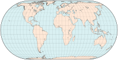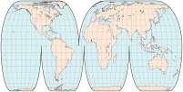

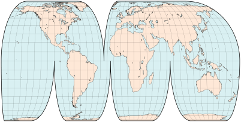
 

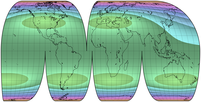

左上：未分瓣的埃克特 IV 地图；右上：分瓣版本保留了投影的特性（包括等积性），同时降低了大陆等优先区域的角变形。上图及右图，同一投影采用分瓣且重定中央经线的处理：每个瓣区中只有一条经线（不一定是中间的那条）被映射为直线——如变形模式所示，这再次改变了优先区域，例如西欧和澳大利亚。

分瓣地图的主要目的是将重要区域移至变形较小的位置，通常靠近每个瓣区的中心。几种制图技巧可增强分瓣的实用性。

**重定中央与裁剪**

尤其是在伪圆柱投影中，分瓣地图的每个瓣区可以方便地使用各自任意选定的中央经线进行投影，而不必与整体中央经线相同。这会引入不对称的角变形，使靠近直线中央经线的区域受益，同时牺牲其他区域。中央经线甚至可能随纬度变化，如菲尔布里克的 Sinu-Mollweide 投影和博格斯等形地图的欧亚瓣区。

重定中央也是未分瓣的大陆或区域地图的有效手段。将感兴趣的区域居中，以最小化变形，然后裁剪掉其余投影区域。重定中央可能采用不同的投影方向，甚至斜轴地图。

**利用低变形区域的重定中央**

<table>
<tr>
    <td>
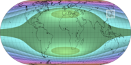
</td>
    <td>
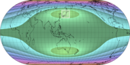
</td>
    <td>
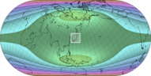
</td>
</tr>
<tr>
    <td>
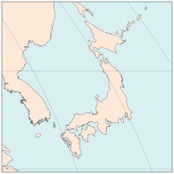
</td>
    <td>
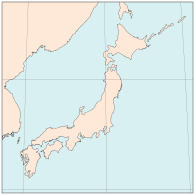
</td>
    <td>
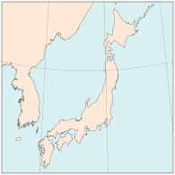
</td>
</tr>
<tr>
  普通赤道地图，以0°经线为中心
  赤道投影，经线重定于137°E：最佳选择
  斜轴投影，完全以日本为中心
</tr>
</table>

这三幅区域地图使用相同的埃克特 IV 投影展示日本列岛。对该投影角变形模式的分析表明，尽管其处处保持面积不变，但仅有中央经线与标准纬线40°30′N 和 S（在赤道投影中）相交的两个小“最佳点”无角变形。三幅地图覆盖相同区域但范围略有不同，第二版中的区域更接近最佳点——东京位于约35°N、139°E。第三幅地图中的斜轴版本实际上变形更大，同时失去了赤道投影中纬线为直线的有用特性。

**压缩与插图**

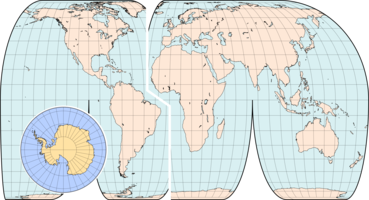

上图，采用埃克特 IV 投影的地图，经分瓣、重定中央经线，并在大西洋处压缩。南极洲以相同比例尺、采用兰伯特方位等积投影绘制在插图中完整呈现。

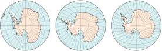

埃克特投影并非插图的最佳选择：在横轴投影中，存在严重的角变形（右）；在将南极移至标准纬线的斜轴投影中，变形减小，但也更不对称（最右细节）。

一些制图技巧实际上是编辑技巧，旨在提高清晰度或方便印刷。它们不影响变形模式，可纯粹作为布局工具使用。

压缩地图常与分瓣同时使用，意指移除不重要区域并将剩余部分连接起来。它可以节省出版空间，或者相反，在相同的印刷面积内允许更大的比例尺和更好的细节。

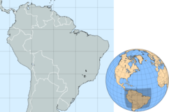

巴西及其邻近区域，在主墨卡托地图中和（阴影部分）插图中。

插图也是一种编辑工具，是主地图上分离或叠加的小图，用于：
*   呈现主投影严重变形、被分割或无法显示的区域（如墨卡托投影中的极地）；方位等距投影常用于极地地区
*   特别是对于小区域或不为人熟知的区域的大比例尺地图，用于快速标示其在地球上的位置；方位正交投影常用于小半球插图中

**滥用分瓣**

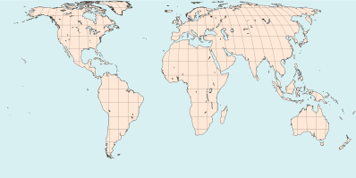
 
分瓣埃克特 IV 地图，未压缩但瓣区间隙被着色为额外的海域；部分经纬网和省略南极洲有助于掩盖这一缺陷。尽管大陆形状比圆柱投影创建的矩形地图呈现得更好，但陆/海面积比例具有误导性，且例如冰岛与格陵兰、西伯利亚与阿拉斯加之间的距离被大大拉伸。

与多种制图技术一样，分瓣可能被滥用或被视为纯粹的编辑便利。仓促或粗心制作的地图可能出现以下问题：

*   未清晰标记压缩区域
*   分瓣间隙未标记，反而暗示连续性

此类地图用于广告或许足够，但用于教学或科学目的则不可接受。