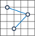

# Well-Known Text格式

# WKT投影

原文链接::[WKT](https://docs.geotools.org/stable/javadocs/org/opengis/referencing/doc-files/WKT.html)

这个是个简化过的版本,详细版本请参照 [Geographic information — Well-known text representation of coordinate reference systems (opengeospatial.org)](http://docs.opengeospatial.org/is/18-010r7/18-010r7.html)

本规范中,所有的实体都能以WKT形式展示,便于将对象持久化存储到数据库中,方便在程序之间互相传输。每个实体都以大写关键字表示（例如，[` DATUM `](https://docs . geo tools . org/stable/javadocs/org/open GIS/referencing/doc-files/wkt . html # DATUM)或[` UNIT `](https://docs . geo tools . org/stable/javadocs/org/open GIS/referencing/doc-files/wkt . html # UNIT)），后跟括号中以逗号分隔的对象定义参数。有些实体是由其他实体组成，形成一个嵌套的结构。实现中，可以用标准括号( )或者方括号[ ]。WKT使用扩展的巴科斯-诺尔范式表示（EBNF）。数学变化的WKT可用于工程坐标系中，因此我们首先展示：

## Math Transform WKT

```
<math transform> = <param mt> | <concat mt> | <inv mt> | <passthrough mt>
<param mt>       = PARAM_MT["<classification name>" {,<parameter>}* ]
<parameter>      = PARAMETER["<name>", <value>]
<value>          = <number>
<concat mt>      = CONCAT_MT[<math transform> {,<math transform>}* ]
<inv mt>         = INVERSE_MT[<math transform>]
<passthrough mt> = PASSTHROUGH_MT[<integer>, <math transform>]
```

## Coordinate System WKT

```
<coordinate system>  = <horz cs> | <geocentric cs> | <vert cs> | <compd cs> | <fitted cs> | <local cs>
<horz cs>            = <geographic cs> | <projected cs>
<projected cs>       = PROJCS["<name>", <geographic cs>, <projection>, {<parameter>,}* <linear unit> {,<twin axes>}{,<authority>}]
<projection>         = PROJECTION["<name>" {,<authority>}]
<geographic cs>      = GEOGCS["<name>", <datum>, <prime meridian>, <angular unit> {,<twin axes>} {,<authority>}]
<datum>              = DATUM["<name>", <spheroid> {,<to wgs84>} {,<authority>}]
<spheroid>           = SPHEROID["<name>", <semi-major axis>, <inverse flattening> {,<authority>}]
<semi-major axis>    = <number>
<inverse flattening> = <number>
<prime meridian>     = PRIMEM["<name>", <longitude> {,<authority>}]
<longitude>          = <number>
<angular unit>       = <unit>
<linear unit>        = <unit>
<unit>               = UNIT["<name>", <conversion factor> {,<authority>}]
<conversion factor>  = <number>
<geocentric cs>      = GEOCCS["<name>", <datum>, <prime meridian>, <linear unit> {,<axis>, <axis>, <axis>} {,<authority>}]
<authority>          = AUTHORITY["<name>", "<code>"]
<vert cs>            = VERT_CS["<name>", <vert datum>, <linear unit>, {<axis>,} {,<authority>}]
<vert datum>         = VERT_DATUM["<name>", <datum type> {,<authority>}]
<datum type>         = <number>
<compd cs>           = COMPD_CS["<name>", <head cs>, <tail cs> {,<authority>}]
<head cs>            = <coordinate system>
<tail cs>            = <coordinate system>
<twin axes>          = <axis>, <axis>
<axis>               = AXIS["<name>", NORTH | SOUTH | EAST | WEST | UP | DOWN | OTHER]
<to wgs84s>          = TOWGS84[<seven param>]
<seven param>        = <dx>, <dy>, <dz>, <ex>, <ey>, <ez>, <ppm>
<dx>                 = <number>
<dy>                 = <number>
<dz>                 = <number>
<ex>                 = <number>
<ey>                 = <number>
<ez>                 = <number>
<ppm>                = <number>
<fitted cs>          = FITTED_CS["<name>", <to base>, <base cs>]
<to base>            = <math transform>
<base cs>            = <coordinate system>
<local cs>           = LOCAL_CS["<name>", <local datum>, <unit>, <axis>, {,<axis>}* {,<authority>}]
<local datum>        = LOCAL_DATUM["<name>", <datum type> {,<authority>}]
```

## 关键字描述:

### AUTHORITY

可选子句，允许外部机构管理实体的定义。

### AXIS

轴的名称是人为定义的，接下来的枚举值允许软件正确地覆盖不同的坐标系。如果可选的“轴”不存在，则采用默认值。它们是:

| 地理坐标系: | `AXIS["Lon",EAST],AXIS["Lat",NORTH]`             |
| ----------- | ------------------------------------------------ |
| 投影坐标系: | `AXIS["X",EAST],AXIS["Y",NORTH]`                 |
| 地心坐标系: | `AXIS["X",OTHER],AXIS["Y",EAST],AXIS["Z",NORTH]` |

然而，如果这些术语存在，并且具有非缺省值，那么在试图覆盖图形之前，必须实现几何对象坐标的变换和反算。

### COMPD_CS

这表示一个复合坐标系，它结合了另外两个坐标系的坐标。例如，复合3D坐标系可以由水平坐标系和垂直坐标系组成。 

### CONCAT_MT

由子变换的串联定义的变换。第一个变换的输出空间的维度必须与第二个变换(如果定义了)的输入空间的维度相匹配，其余的子变换也是如此。 .

### DATUM

这表示水平基准面，用于测量地球表面位置。 

### FITTED_CS

这表示拟合坐标系。数学变换被用来构建一个从拟合坐标系到基准坐标系的映射。该变换通常是仿射映射。数学变换从拟合的坐标系到基准坐标系，因此拟合的坐标系可以有一个比基准坐标系更小的维度。这通常是相当有用的。例如，一个拟合的坐标系可以是一个与地球近似相切的二维平面，但基于WGS84地心三维坐标系。

### GEOCCS

地心坐标系(Geocentric Coordinate Systems)，原点位于地球中心的三维坐标系。X轴指向本初子午线。Y轴指向东或西。Z轴指向北或南。默认情况下，Z轴将指向北方，Y轴将指向东方（例如右手系统），但您应该检查轴的非默认值。

### GEOGCS

地理坐标系（Geographic Coordinate Systems）基于纬度和经度的坐标系。有些地理坐标系是纬度/经度，有些是经度/纬度。你可以通过检查坐标轴来找出这是哪一个。您还应该检查角度单位，因为并非所有地理坐标系都使用度。 

### INVERSE_MT

一个数学变换,被定义为另一个变换的逆运算。

### LOCAL_DATUM

这表示当地的基准面。

### LOCAL_CS

这表示一个局部的、没有地理参考的坐标系。这种坐标系通常用于CAD系统中。它们也可用于本地调查，在这种情况下，调查地点与世界其他地方的关系并不重要。[` AXIS `](https://docs . geotools . org/stable/javadocs/org/open GIS/referencing/doc-files/wkt . html # AXIS)子句的数量表示局部坐标系的维度。 

### PARAMETER

命名的投影参数值。参数的单位必须从其上下文中推断出来。如果参数在[` PROJCS `](https://docs . geotools . org/stable/javadocs/org/open GIS/referencing/doc-files/wkt . html # PROJCS)内，则它的单位将与[` PROJCS `](https://docs . geotools . org/stable/javadocs/org/open GIS/referencing/doc-files/wkt . html # PROJCS)的单位匹配。如果参数位于 [`PARAM_MT`](https://docs . geotools . org/stable/javadocs/org/open GIS/referencing/doc-files/wkt . html # PARAM _ MT)中，则长度和角度的单位分别为米和度。 

### PARAM_MT

一个参数化的数学变换。所有长度参数以米表示，所有角度参数以度表示。其他参数应尽可能使用国际单位制。(例如，用千克表示质量，用秒表示时间。) 

<classification name>是一个编码值，用于指定数学转换所使用的公式。参见参数化变换的合法值以及相应的参数。

### PASSTHROUGH_MT

这是一个数学变换，它将一个坐标子集传递给另一个变换。这允许变换在纵坐标的子集上操作。例如，如果您有(Lat，Lon，Height)坐标，那么您可能希望在不影响(Lat，Lon)值的情况下将高度值从米转换为英尺。如果您想影响(Lat，Lon)值，而不去管高度值，那么您必须将纵坐标换成(Height，Lat，Lon)。你可以用仿射映射做到这一点。

 <integer> 参数是第一个受影响的纵坐标的索引。<math transform>参数是要传递坐标的转换。 

### PRIMEM

这定义了用于测量经度的子午线。<longitude> 的单位必须从上下文中推断出来。如果`PRIMEM`子句出现在[`GEOGCS`](https://docs.geotools.org/stable/javadocs/org/opengis/referencing/doc-files/WKT.html#GEOGCS)中，那么经度单位将与地理坐标系统的单位一致。如果`PRIMEM`子句出现在[`GEOCCS`](https://docs.geotools.org/stable/javadocs/org/opengis/referencing/doc-files/WKT.html#GEOCCS)内，那么单位将是度。

经度值定义了本初子午线相对于格林威治子午线的角度。正值表示本初子午线在格林威治以东，负值表示本初子午线在格林威治以西。

### PROJCS

这表示一个投影坐标系统。[`PROJECTION`](https://docs.geotools.org/stable/javadocs/org/opengis/referencing/doc-files/WKT.html#PROJECTION)子句包含了`MathTransformFactory`使用的分类名称，而[`PARAMETER`](https://docs.geotools.org/stable/javadocs/org/opengis/referencing/doc-files/WKT.html#PARAMETER)子句指定了参数。然而，`MathTransformFactory`使用的单位总是米和度，而[`PARAMETER`](https://docs.geotools.org/stable/javadocs/org/opengis/referencing/doc-files/WKT.html#PARAMETER)子句中的单位分别是[`PROJCS`](https://docs.geotools.org/stable/javadocs/org/opengis/referencing/doc-files/WKT.html#PROJCS)/[`GEOGCS`](https://docs.geotools.org/stable/javadocs/org/opengis/referencing/doc-files/WKT.html#GEOGCS)的长度/角度单位。因此，如果你写代码来读或写WKT，那么你必须做单位转换--要小心！

(注意，这种单位处理方式与EPSG 4数据库的工作方式略有不同。在EPSG 4数据库中，每个转换参数值都定义了自己的单位。然而，99%的EPSG投影参数单位与相应的投影坐标系的单位相同）。

### PROJECTION

这描述了从地理坐标到投影坐标的投影。它在 [`PROJCS`](https://docs.geotools.org/stable/javadocs/org/opengis/referencing/doc-files/WKT.html#PROJCS)中用于定义投影变换的参数。 

### SPHEROID

这描述了一个球体，它是地球表面被压扁的近似球体。在本文件中，"spheroid"和 "ellipsoid"是同义词。术语  "`SPHEROID`" 在WKT中使用是为了与Simple Features兼容。然而，在本规范的其他地方，术语 "ellipsoid"是首选。

### TOWGS84

这表示多达7个Bursa Wolf转化参数的列表。这些参数可用于近似从水平基准面到WGS84基准面的转换。然而，必须记住，这种变换只是一种近似。对于给定的水平基准面，可以使用不同的Bursa Wolf变换来最小化不同区域上的误差。

如果[` DATUM `](https://docs . geotools . org/stable/javadocs/org/open GIS/referencing/doc-files/wkt . html # DATUM)子句包含一个 `TOWGS84`子句，那么这应该是它的“首选”变换，它通常是对整个感兴趣区域(例如，包含地理坐标系统中的感兴趣区域)给出广泛近似的变换。有时，只定义了前三个或六个参数。在这种情况下，剩余的参数必须为零。如果只定义了三个参数，那么它们仍然可以插入到Bursa Wolf公式中，或者您可以走捷径。Bursa Wolf变换适用于地心坐标，因此您不能将其直接应用于地理坐标。如果只有三个参数，那么您可以使用Molodenski 公式或简化的Molodenski 公式。

在以下情况中, [`DATUM`](https://docs.geotools.org/stable/javadocs/org/opengis/referencing/doc-files/WKT.html#DATUM) 子句可能不包含 `TOWGS84` :

*  编写的应用程序使用Simple Features规范，该规范没有指定`TOWGS84`为有效的关键词。
* 编写的应用程序没有可用的转换。
* 转换无法实现。例如，水平基准面可以是一个相对于地球表面旋转的表面

特别地，如果[` DATUM `](https://docs . geotools . org/stable/javadocs/org/open GIS/referencing/doc-files/wkt . html # DATUM)确实包含 `TOWGS84` 子句，并且参数值为零，则接收应用程序可以假定编写应用程序认为该基准面近似等于WGS84。

### UNIT

这描述了用于父WKT子句中其他地方的值的单位（有时包括父子句的后代）。单位的物理尺寸（即类型）由上下文决定。例如，在一个[`GEOGCS`](https://docs.geotools.org/stable/javadocs/org/opengis/referencing/doc-files/WKT.html#GEOGCS)中，单位的类型是角度。在[`VERT_CS`](https://docs.geotools.org/stable/javadocs/org/opengis/referencing/doc-files/WKT.html#VERT_CS)中，单位的类型是长度。在一个`UNIT`子句中，单位的描述是通过将它们与该类型的基本单位用一个转换系数联系起来。对于长度单位，转换系数是将描述的单位转换为米的标量值。对于角度单位，转换系数是将描述的单位转换为弧度的标量值。

### VERT_DATUM

这表示垂直基准面，或用于垂直测量的方法。 

### VERT_CS

这表示一个垂直坐标系。

## WKT 样例

下面的例子显示了一个三维复合坐标系，它是由一个投影坐标系和一个垂直坐标系组合而成。这与XML示例中使用的坐标系相同。

```
COMPD_CS["OSGB36 / British National Grid + ODN",
    PROJCS["OSGB 1936 / British National Grid",
        GEOGCS["OSGB 1936",
            DATUM["OSGB_1936",
                SPHEROID["Airy 1830",6377563.396,299.3249646,AUTHORITY["EPSG","7001"]],
                TOWGS84[375,-111,431,0,0,0,0],
                AUTHORITY["EPSG","6277"]],
            PRIMEM["Greenwich",0,AUTHORITY["EPSG","8901"]],
            UNIT["DMSH",0.0174532925199433,AUTHORITY["EPSG","9108"]],
            AXIS["Lat",NORTH],
            AXIS["Long",EAST],
            AUTHORITY["EPSG","4277"]],
        PROJECTION["Transverse_Mercator"],
        PARAMETER["latitude_of_origin",49],
        PARAMETER["central_meridian",-2],
        PARAMETER["scale_factor",0.999601272],
        PARAMETER["false_easting",400000],
        PARAMETER["false_northing",-100000],
        UNIT["metre",1,AUTHORITY["EPSG","9001"]],
        AXIS["E",EAST],
        AXIS["N",NORTH],
        AUTHORITY["EPSG","27700"]],
    VERT_CS["Newlyn",
        VERT_DATUM["Ordnance Datum Newlyn",2005,AUTHORITY["EPSG","5101"]],
        UNIT["metre",1,AUTHORITY["EPSG","9001"]],
        AXIS["Up",UP],
        AUTHORITY["EPSG","5701"]],
    AUTHORITY["EPSG","7405"]]
```

# WKT要素

open GIS “Consortium Simple Features for SQL”规范定义了WKT格式，以ASCII格式交换几何数据。[ISO“SQL/MM Part:3 Spatial”](https://portal.ogc.org/files/?artifact_id=25355)标准也引用了这种格式。

 以下示例中,没有带z或者m坐标,实际上可以加上Z,M坐标,形成三维或者四维的数据

WKT的几何图形文本格式定义如下:

| 几何类型           | 图形                                                         | 示例                                                         |
| :----------------- | :----------------------------------------------------------- | :----------------------------------------------------------- |
| Point              |          | POINT(-122.349 47.651)                                       |
| LineString         |  | LINESTRING(-122.360 47.656, -122.343 47.656)                 |
| Polygon            |      | POLYGON((-122.358 47.653, -122.348 47.649, -122.348 47.658, -122.358 47.658, -122.358 47.653)) |
| MultiPoint         |  | MULTIPOINT(-122.360 47.656, -122.343 47.656)                 |
| MultiLineString    |  | MULTILINESTRING ((-122.358 47.653, -122.348 47.649, -122.348 47.658), (-122.357 47.654, -122.357 47.657, -122.349 47.657, -122.349 47.650)) |
| MultiPolygon       |  | MULTIPOLYGON(((-122.358 47.653, -122.348 47.649, -122.358 47.658, -122.358 47.653)), ((-122.341 47.656, -122.341 47.661, -122.351 47.661, -122.341 47.656))) |
| GeometryCollection |  | GEOMETRYCOLLECTION ( POINT(-122.34900 47.65100), LINESTRING(-122.360 47.656, -122.343 47.656)) |
| EMPTY              |                                                              | POINT EMPTY <br/> MULTIPOINT EMPTY<br/>LINESTRING EMPTY<br/>MULTILINESTRING EMPTY<br/>MULTILINESTRING(EMPTY)<br/>POLYGON EMPTY<br/>POLYGON(EMPTY)<br/>MULTIPOLYGON EMPTY<br/>MULTIPOLYGON(EMPTY)                                                  |

# WKB要素

本节描述了WKB格式如何表述几何要素

OpenGIS协会“Simple Features for SQL”规范定义了well-known binary格式。国际标准化组织(ISO)“SQL/MM Part:3 Spatial”标准也定义了这种格式。

WKB格式的基本构造块是点的字节流，它由两个双精度值组成。其他几何图形的字节流是使用已经定义的几何图形的字节流构建的。 

Well-known binary (WKB) 一般用[十六进制](http://en.wikipedia.org/wiki/Hexadecimal)字符串表示.

第一个字节表示数据的字节序

- `00` : 大端
- `01` : 小端

后面的四个字节(一个integer)用于表示几何类型:

| Type               | 2D     | Z      | M      | ZM     |
| ------------------ | ------ | ------ | ------ | ------ |
| Geometry           | `0000` | `1000` | `2000` | `3000` |
| Point              | `0001` | `1001` | `2001` | `3001` |
| LineString         | `0002` | `1002` | `2002` | `3002` |
| Polygon            | `0003` | `1003` | `2003` | `3003` |
| MultiPoint         | `0004` | `1004` | `2004` | `3004` |
| MultiLineString    | `0005` | `1005` | `2005` | `3005` |
| MultiPolygon       | `0006` | `1006` | `2006` | `3006` |
| GeometryCollection | `0007` | `1007` | `2007` | `3007` |
| CircularString     | `0008` | `1008` | `2008` | `3008` |
| CompoundCurve      | `0009` | `1009` | `2009` | `3009` |
| CurvePolygon       | `0010` | `1010` | `2010` | `3010` |
| MultiCurve         | `0011` | `1011` | `2011` | `3011` |
| MultiSurface       | `0012` | `1012` | `2012` | `3012` |
| Curve              | `0013` | `1013` | `2013` | `3013` |
| Surface            | `0014` | `1014` | `2014` | `3014` |
| PolyhedralSurface  | `0015` | `1015` | `2015` | `3015` |
| TIN                | `0016` | `1016` | `2016` | `3016` |
| Triangle           | `0017` | `1017` | `2017` | `3017` |

每种几何类型有特定的数据结构,例如点数量或者多边形的环数量,后面的坐标用双精度浮点型数据表示(double)

举个例子, 点 `POINT(2.0 4.0)` 被表示为: `000000000140000000000000004010000000000000`:

- 1-byte integer `00`: 大端
- 4-byte integer `00000001` : POINT (2D)
- 8-byte float `4000000000000000` : *x*-坐标
- 8-byte float `4010000000000000` : *y*-坐标

下图是一个Polygon要素,有一个内环和一个外环:


WKB详细的定义如下:

``` c++
// Basic Type definitions
// byte : 1 byte
// uint32 : 32 bit unsigned integer (4 bytes)
// double : double precision number (8 bytes)
// Building Blocks : Coordinate, LinearRing
Point
{
    double x;
    double y;
}
PointZ
{
    double x;
    double y;
    double z;
}
PointM
{
    double x;
    double y;
    double m;
}
PointZM
{
    double x;
    double y;
    double z;
    double m;
}
LinearRing
{
    uint32 numPoints;
    Point points[numPoints];
}
LinearRingZ
{
    uint32 numPoints;
    PointZ points[numPoints];
}
LinearRingM
{
    uint32 numPoints;
    PointM points[numPoints];
}
LinearRingZM
{
    uint32 numPoints;
    PointZM points[numPoints];
}
enum WKBByteOrder
{
    wkbXDR = 0, // Big Endian
    wkbNDR = 1; // Little Endian
}
enum WKBGeometryType
{
    wkbPoint = 1,
    wkbLineString = 2,
    wkbPolygon = 3,
    wkbTriangle = 17,
    wkbMultiPoint = 4,
    wkbMultiLineString = 5,
    wkbMultiPolygon = 6,
    wkbGeometryCollection = 7,
    wkbPolyhedralSurface = 15,
    wkbTIN = 16,
    wkbPointZ = 1001,
    wkbLineStringZ = 1002,
    wkbPolygonZ = 1003,
    wkbTrianglez = 1017,
    wkbMultiPointZ = 1004,
    wkbMultiLineStringZ = 1005,
    wkbMultiPolygonZ = 1006,
    wkbGeometryCollectionZ = 1007,
    wkbPolyhedralSurfaceZ = 1015,
    wkbTINZ = 1016,
    wkbPointM = 2001,
    wkbLineStringM = 2002,
    wkbPolygonM = 2003,
    wkbTriangleM = 2017,
    wkbMultiPointM = 2004,
    wkbMultiLineStringM = 2005,
    wkbMultiPolygonM = 2006,
    wkbGeometryCollectionM = 2007,
    wkbPolyhedralSurfaceM = 2015,
    wkbTINM = 2016,
    wkbPointZM = 3001,
    wkbLineStringZM = 3002,
    wkbPolygonZM = 3003,
    wkbTriangleZM = 3017,
    wkbMultiPointZM = 3004,
    wkbMultiLineStringZM = 3005,
    wkbMultiPolygonZM = 3006,
    wkbGeometryCollectionZM = 3007,
    wkbPolyhedralSurfaceZM = 3015,
    wkbTinZM = 3016,
    ;
}
WKBPoint
{
    byte byteOrder;
    static uint32 wkbType = 1;
    Point point;;
}
WKBPointZ
{
    byte byteOrder;
    static uint32 wkbType = 1001;
    PointZ point;;
}
WKBPointM
{
    byte byteOrder;
    static uint32 wkbType = 2001;
    PointM point;;
}
WKBPointZM
{
    byte byteOrder;
    static uint32 wkbType = 3001;
    PointZM point;;
}
WKBLineString
{
    byte byteOrder;
    static uint32 wkbType = 2;
    uint32 numPoints;
    Point points[numPoints];;
}
WKBLineStringZ
{
    byte byteOrder;
    static uint32 wkbType = 1002;
    uint32 numPoints;
    PointZ points[numPoints];;
}
WKBLineStringM
{
    byte byteOrder;
    static uint32 wkbType = 2002;
    uint32 numPoints;
    PointM points[numPoints];;
}
WKBLineStringZM
{
    byte byteOrder;
    static uint32 wkbType = 3002;
    uint32 numPoints;
    PointZM points[numPoints];
}
WKBPolygon
{
    byte byteOrder;
    static uint32 wkbType = 3;
    uint32 numRings;
    LinearRing rings[numRings];
}
WKBPolygonZ
{
    byte byteOrder;
    static uint32 wkbType = 1003;
    uint32 numRings;
    LinearRingZ rings[numRings];
}
WKBPolygonM
{
    byte byteOrder;
    static uint32 wkbType = 2003;
    uint32 numRings;
    LinearRingM rings[numRings];
}
WKBPolygonZM
{
    byte byteOrder;
    static uint32 wkbType = 3003;
    uint32 numRings;
    LinearRingZM rings[numRings];
}
WKBTriangle
{
    byte byteOrder;
    static uint32 wkbType = 17;
    uint32 numRings;
    LinearRing rings[numRings];
}
WKBTriangleZ
{
    byte byteOrder;
    static uint32 wkbType = 10 17;
    uint32 numRings;
    LinearRingZ rings[numRings];
}
WKBTriangleM
{
    byte byteOrder;
    static uint32 wkbType = 20 17;
    uint32 numRings;
    LinearRingM rings[numRings];
}
WKBTriangleZM
{
    byte byteOrder;
    static uint32 wkbType = 30 17;
    uint32 numRings;
    LinearRingZM rings[numRings];
}
WKBPolyhedralSurface
{
    byte byteOrder;
    static uint32 wkbType = 15;
    uint32 numPolygons;
    WKBPolygon polygons[numPolygons];
}
WKBPolyhedralSurfaceZ
{
    byte byteOrder;
    static uint32 wkbType = 1015;
    uint32 numPolygons;
    WKBPolygonZ polygons[numPolygons];
}
WKBPolyhedralSurfaceM
{
    byte byteOrder;
    static uint32 wkbType = 2015;
    uint32 numPolygons;
    WKBPolygonM polygons[numPolygons];
}
WKBPolyhedralSurfaceZM
{
    byte byteOrder;
    static uint32 wkbType = 3015;
    uint32 numPolygons;
    WKBPolygonZM polygons[numPolygons];
}
WKBTIN
{
    byte byteOrder;
    static uint32 wkbType = 16;
    uint32 numPolygons;
    WKBPolygon polygons[numPolygons];
}
WKBTINZ
{
    byte byteOrder;
    static uint32 wkbType = 1016;
    uint32 numPolygons;
    WKBPolygonZ polygons[numPolygons];
}
WKBTINM
{
    byte byteOrder;
    static uint32 wkbType = 2016;
    uint32 numPolygons;
    WKBPolygonM polygons[numPolygons];
}
WKBTINZM
{
    byte byteOrder;
    static uint32 wkbType = 3016;
    uint32 numPolygons;
    WKBPolygonZM polygons[numPolygons];
}
WKBMultiPoint
{
    byte byteOrder;
    static uint32 wkbType = 4;
    uint32 numPoints;
    WKBPoint points[numPoints];
}
WKBMultiPointZ
{
    byte byteOrder;
    static uint32 wkbType = 1004;
    uint32 numPoints;
    WKBPointZ points[numPoints];
}
WKBMultiPointM
{
    byte byteOrder;
    static uint32 wkbType = 2004;
    uint32 numPoints;
    WKBPointM points[numPoints];
}
WKBMultiPointZM
{
    byte byteOrder;
    static uint32 wkbType = 3004;
    uint32 numPoints;
    WKBPointZM points[numPoints];
}
WKBMultiLineString
{
    byte byteOrder;
    static uint32 wkbType = 5;
    uint32 numLineStrings;
    WKBLineString lineStrings[numLineStrings];
}
WKBMultiLineStringZ
{
    byte byteOrder;
    static uint32 wkbType = 1005;
    uint32 numLineStrings;
    WKBLineStringZ lineStrings[numLineStrings];
}
WKBMultiLineStringM
{
    byte byteOrder;
    static uint32 wkbType = 2005;
    uint32 numLineStrings;
    WKBLineStringM lineStrings[numLineStrings];
}
WKBMultiLineStringZM
{
    byte byteOrder;
    static uint32 wkbType = 3005;
    uint32 numLineStrings;
    WKBLineStringZM lineStrings[numLineStrings];
}
WKBMultiPolygon
{
    byte byteOrder;
    static uint32 wkbType = 6;
    uint32 numPolygons;
    WKBPolygon polygons[numPolygons];
}
WKBMultiPolygonZ
{
    byte byteOrder;
    static uint32 wkbType = 1006;
    uint32 numPolygons;
    WKBPolygonZ polygons[numPolygons];
}
WKBMultiPolygonM
{
    byte byteOrder;
    static uint32 wkbType = 2006;
    uint32 numPolygons;
    WKBPolygonM polygons[numPolygons];
}
WKBMultiPolygonZM
{
    byte byteOrder;
    static uint32 wkbType = 3006;
    uint32 numPolygons;
    WKBPolygonZM polygons[numPolygons];
}
WKBGeometryCollection
{
    byte byte_order;
    static uint32 wkbType = 7;
    uint32 numGeometries;
    WKBGeometry geometries[numGeometries];
}
WKBGeometryCollectionZ
{
    byte byte_order;
    static uint32 wkbType = 1007;
    uint32 numGeometries;
    WKBGeometryZ geometries[numGeometries];
}
WKBGeometryCollectionM
{
    byte byte_order;
    static uint32 wkbType = 2007;
    uint32 numGeometries;
    WKBGeometryM geometries[numGeometries];
}
WKBGeometryCollectionZM
{
    byte byte_order;
    static uint32 wkbType = 3007;
    uint32 numGeometries;
    WKBGeometryZM geometries[numGeometries];
}
WKBGeometry {
    union {
        WKBPoint point;
        WKBLineString linestring;
        WKBPolygon polygon;
        WKBTriangle triangle
        WKBPolyhedralSurface polyhedralsurface
        WKBTIN tin
        WKBMultiPoint mpoint;
        WKBMultiLineString mlinestring;
        WKBMultiPolygon mpolygon;
        WKBGeometryCollection collection;
    };
};
WKBGeometryZ
{
    union {
        WKBPointZ pointz;
        WKBLineStringZ linestringz;
        WKBPolygonZ polygonz;
        WKBTriangleZ trianglez
        WKBPolyhedralSurfaceZ Polyhedralsurfacez;
        WKBTinZ tinz
        WKBMultiPointZ mpointz;
        WKBMultiLineStringZ mlinestringz;
        WKBMultiPolygonZ mpolygonz;
        WKBGeometryCollectionZ collectionz;
    };
};
WKBGeometryM {
    union {
        WKBPointM pointm;
        WKBLineStringM linestringm;
        WKBPolygonM polygonm;
        WKBTriangleM trianglem
        WKBPolyhedralSurfaceM Polyhedralsurfacem;
        WKBTinM tinm
        WKBMultiPointM mpointm;
        WKBMultiLineStringM mlinestringm;
        WKBMultiPolygonM mpolygonm;
        WKBGeometryCollectionM collectionm;
    };
};
WKBGeometryZM {
    union {
        WKBPointZM pointzm;
        WKBLineStringZM linestringzm;
        WKBPolygonZM polygonzm;
        WKBTriangleZM trianglezm
        WKBPolyhedralSurfaceM Polyhedralsurfacezm;
        WKBTinZM tinzm
        WKBMultiPointZM mpointzm;
        WKBMultiLineStringZM mlinestringzm;
        WKBMultiPolygonZ mpolygonzm;
        WKBGeometryCollectionZM collectionzm;
    };
};
```


