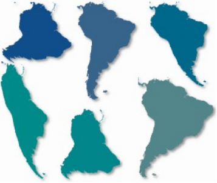
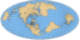

# 地图投影介绍

原文链接:: [Cartographical Map Projections](https://web.archive.org/web/20180702154323/http://progonos.com/furuti/MapProj/Normal/TOC/cartTOC.html)

下图是相同比例尺，不同的投影面下的南美地图。哪种投影是最好的？哪种投影是对的？简而言之，没有正确答案，至少不是一直都有正确答案；因为即便使用的是同一种投影，仅需要改变投影面，就可以重塑整个大陆的形状。但如果你想要一个有根据的答案，请继续阅读。

制图学是制作地图的科学。它包括许多问题和技术，包括：
   * 测量地球的形状和特征
   * 收集和存储有关地形、地点和人员等地理信息
   * 将三维行星表示为平面地图（我的主要关注点）
   * 设计图示和图例来表达数据
   * 将地理信息印刷和出版

为了不同的目的,我们设计了各式各样的地图。当看到两幅不同的世界地图时，我们会思考它们的区别：
  * 为什么把世界画成矩形或者椭圆形，不应该是圆形么？
  * 经纬网必须是平行的么，经线纬线是直的还是弯的？
  * 南美的“尾巴”是向东弯曲还是向西弯曲？
  * 到底什么才是绘制我们这个独特的星球的“正确”的方式？（或者更确切的说，是否有这么一种方式正确的描绘我们的地球？）

制图学的一个重要问题是解决如何投影：即将点从一个几乎是球形的大石头上（我们的地球）转移到平面上(即纸上或者电脑屏幕上)。以下非正式的描述了一些重要的制图概念，地图是如何绘制的，以及为什么世界地图有这么多不同类型的投影。您可以从这里开始阅读，使用翻页来顺序阅读，或者使用以下目录：

- 简介
	-  [简单的地图背景知识介绍](./简单的地图背景知识介绍.md)
	-  [制图学基础知识和投影选择](./制图学基础知识和投影选择.md)
- 按地图目的划分投影
	-  [有用的地图属性](./有用的地图属性.md)
		- [距离和比例尺](./距离和比例尺.md)
		- [测地线](测地线.md)
	- [方向](方向.md)
	- [形状](形状.md)
	- [面积](面积.md)
	- [变形椭圆](变形椭圆.md)
	- [角度变形](失真模式.md)
- 制图学中的数学
	-  [如何创建投影](./如何创建投影.md)，以下投影为例：
		- [正轴方位投影](正轴方位投影.md)
		- [正轴圆柱投影](正轴圆柱投影.md)
		- [Kavrayskiy's VII投影](Kavrayskiy_s_VII投影.md)
		- [等积正弦投影](等积正弦投影.md)
		- [克拉斯特抛物线投影](克拉斯特抛物线投影.md)
		- [摩尔维特 (Mollweide) 投影](摩尔维特投影.md)
		- [极/赤道方位等距等面积投影](极赤道方位等距等面积投影.md)
		- [等距圆柱投影_Winkel I / II](等距圆柱投影_Winkel_1_2.md)
		- [埃托夫/汉莫尔/温克尔三重投影](埃托夫_汉莫尔_温克尔三重投影.md)
- 主要投影组
	-  [方位投影](方位投影.md)
	-  [圆柱投影](圆柱投影.md)
	-  [伪圆柱投影](伪圆柱投影.md)
	-  [圆锥投影](圆锥投影.md)
	-  [伪圆锥投影](伪圆锥投影.md)
	-  [修正方位投影](修正方位投影.md)
	-  [正形投影](正形投影.md)
	-  [其他有趣的投影](其他有趣的投影.md)
- 应对变形:
	-  [倾斜和弯曲投影_斜轴投影](倾斜和弯曲投影_斜轴投影.md)
	-  [撕开地球的皮肤_分瓣投影](撕开地球的皮肤_分瓣投影.md)
		- [星形投影](星形投影.md)
		- [分瓣和复合圆锥投影](分瓣和复合圆锥投影.md)
		- [经典分瓣投影](经典分瓣投影.md)
		- [任意分瓣投影](任意分瓣投影.md)
		- [分瓣技巧](分瓣技巧.md)
	- 将地球改造成奇异行星:
		- [多面体地图介绍和四面体地图](多面体地图.md)
		- [立方体和八面体地图](立方体和八面体地图.md)
		- [二十面体/十二面体/其他地图](二十面体_十二面体_其他地图.md)
		- [用于打印和折叠的地图](用于打印和折叠的地图.md)
- 史海钩沉
	- [在现代之前发展的投影](在现代之前发展的投影.md)
- 投影（施工中）
	- 缩小世界的投影: [墨卡托投影和等距离方位投影](墨卡托投影和等距离方位投影.md)
	-  [一些投影应用](一些投影应用.md)
	- [Web墨卡托投影](Web墨卡托.md)
- 总结
	- [投影摘要和表格](投影摘要和表格.md)