# 投影摘要和表格
原文链接:: [Summary and Table](https://web.archive.org/web/20180227085810/http://www.progonos.com/furuti/MapProj/Normal/ProjTbl/projTbl.html)

## 摘要

几种方法试图对投影进行分类。大多数是正交的，因此任何单一的投影可能同时属于不同的类别。在其他领域，像生物学启发的莫勒，应用了分支分类学。

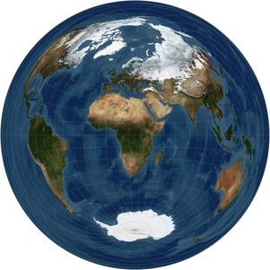
 
根据兰伯特方位角等面积投影法的赤道方面的世界。美国国家航空航天局（NASA）提供的未经推算的原始卫星数据

请注意，为了便于定义和可视化，下面非正式地用纬线和经线描述了一些类别和投影，因此一些属性似乎取决于地图使用的特定方面。例如，柱形地图中的坐标线在赤道上以直角相交，但在极向或斜向地图中则不然，尽管所有其他性质仍然成立；毕竟，方里网只是一组常规的线。

### 根据几何形状划分

| 
分类
      | 属性 |
| ---- | ----|
| 方位投影 | 也叫天顶。显示单个点的真实方向(方位角)；在极面上，所有的纬线都是圆形的，经线是均匀间隔的直线，并在一点上重合；未裁切的世界地图像一张光盘。|
| 圆柱投影 | 通过类比将圆柱体定义为中间投影面；在赤道方面，所有的纬线和经线都是直线；经线与纬线正交，间距均匀；未裁剪的世界地图是矩形的 |
| 圆锥投影 | 类似于圆锥形中间投影面；在极地方面，所有的纬线都是同心圆，而经线是垂直于每条纬线的直线，均匀间隔小于地球上的距离；未裁剪的地图是圆形或环形扇形 |
| 伪圆柱投影 | 在赤道方面，所有的纬线都是直的平行线；经线是任意曲线，沿每条平行线等距分布 |
| 伪圆锥投影 | 在极面上，所有的纬线都是同心圆弧，而经线是任意曲线 |
| 任意投影 | 纬线和经线是任意曲线；通常没有定义纯几何结构。一些作者称“任意的”、“传统的”或“妥协的”不是从几何装置中得到的，而是为某个目的定制的任何投影 |

从某种意义上说，圆锥包括圆柱(顶点在无穷远处的圆锥)和平面(高度为零的圆锥)这两种极端情况。因此，圆锥群概括了方位角投影和柱面投影，以及广义上的伪柱面投影和伪圆锥投影。此外，一些人认为多谐群包括从圆导出平行线的投影，包括像哈默和艾托夫那样的修正方位角。实际上，许多所谓的“方位角”、“圆锥形”或“圆柱形”投影不是建立在使用实体的纯投影过程上，而是由于映射坐标网格的几何属性而被如此分类。

此外，投影、几何或透视投影可以精确地类比于将原始表面连接到地图表面的光线的几何设置来描述。一些作者称其他投影为“数学”。

### 按属性分类

<table>
<tr>
    <td>
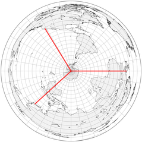
</td>
    <td>
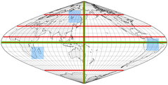
</td>
    <td>
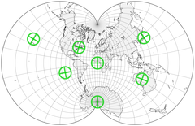
</td>
</tr>
</table>

在方位角投影中，从投影中心（可能与地图中心重合，也可能不重合）辐射出的直线之间的角度与地球上的相应直线相同。在左边的方位角等距地图上，沿这些线的距离也与地球上的距离成正比。

在等面积正弦地图上（右上方），对于任何两条相同的边界（如蓝色方块），它们在地球上的对应线将包围相同的区域，尽管它们不一定有相同的形状。该伪圆柱形投影仅沿两根轴（绿色）保留了角度；它仅沿这些轴和所有垂直于小轴的线是等距的（红色）。

与其他几乎所有的保角投影不同，艾森洛尔投影（左下）在每一点上都保留了小角度：绿色线条在地球和地图上都是垂直的。面积和距离失真很大，但比典型的保形地图要小。

|
分类
    | 属性  |
| ----- | -------------|
| 等面积| 地图上的任何区域的面积都与球面上的相应区域成正比；也称为等值或绝对的。一般来说，对统计比较和教学的目的更有用。|
| 等距离 | 在地图上有两组点A和B，这样，沿着一组选定的线（不一定是直线），从A中的任何一点到B中的另一点的距离都与球体上相应的点之间的距离成正比，同样是沿着这些相应的线。 换句话说，比例在这些线上是恒定的，这些线被称为标准线。 大多数投影都有这样的集合，但实际上很少有被称为 "等距 "的。|
| 等角 | 在地图的任何 小区域内，两条并行的线与球面上的对应线具有相同的角度，因此形状被局部保留了。也叫正交或正形,共形,保角。对导航和大规模制图最重要，特别是在椭圆体的情况下;在几乎每一个等角投影中，至少有一个点（经常选择一个极点）要么不能被显示，要么不等角。|
| 任意 | 既不等角也不等距离 |

### 投影简述

下面列举的投影会有进一步的详细说明。这只是所有现有设计的一个小样本，不一定是最重要或最常用的；因此，选择必然是主观的。同样主观的是，改变方面或另一个小细节是否足以证明一个单独的条目是合理的（例如，卡西尼的对等圆柱形，高斯横向对墨卡托和彼得曼对伯格豪斯）。

| 
经纬网示例
   | 常用名| 主要属性   |
| ----------- | ------ | ----------|
| 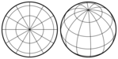 | 正交投影,方位正交投影 | 方位,从无限远看地球方位角的现实视角,最多显示一个半球 |
| 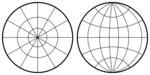 | 方位立体投影,立体投影|方位，保形，保留所有圆；最多显示一个半球|
| 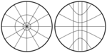 | 日晷投影,中心投影,球心投影 | 方位,大圆被映射为直线 远离中心的极端失真；显示少于一个半球 |
| 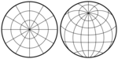  |general vertical perspective|方位投影，正交投影、立体投影、日晷的方位投影的一般情况。从空间直接朝向地球中心的最现实的观点。以投影中心的距离为参数；La Hire, Parent, Lowry, Fischer, Gretschel, James, Clarke ("Twilight")等人的特殊案例。|
| 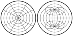 |azimuthal equidistant, zenithal equidistant|非透视方位角，保留沿任何接触地图中心的线的距离|
| 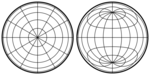 |兰伯特方位等积|非透视。独特的方位等面积投影法|
| 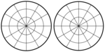 |Ginzburg's azimuthal I and II|非透视的，既不是等面积的，也不是等角的|
| 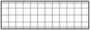 |Lambert's equal-area cylindrical; variations by Behrmann, Trystan Edwards, Gall's (orthographic), Peters, Dyer, Tobler/Chen|唯一可能的圆柱形等面积投影，包括像Gall's ("Peters")和Hobo-Dyer这样的比例变体，它们只在标准纬线上有所不同|
|  |Gall's stereographic cylindrical|既不是等角，也不等积。变体包括布劳恩的立体圆柱和BSAM圆柱投影|
| 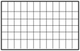 |Braun's stereographic cylindrical|既不等角也不等积,高尔投影的特殊情况|
| 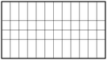 |中心圆柱|既不保形也不等面积；不要和墨卡托的混淆。横向方向为Wetch投影|
| 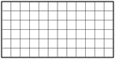 |等长方形、等距圆柱形、普通图、平面图；特殊情况是简单圆柱形（plate carrée）、Gall的等距图和卡西尼图|圆柱形，非常快速和容易计算，既不保形也不等面积；在最常见的情况下，映射成一个长宽比为2：1的矩形（宽为高的两倍）。|
| 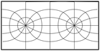 |Cassini|plate carrée横轴情况|
| 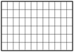 |	Gall's isographic|等距圆柱形的特殊情况，标准纬线45°N和45°S|
| 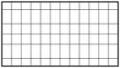 |墨卡托，等角圆柱；横轴椭球体称为高斯等角或高斯-克鲁格|唯一可能的等角圆柱投影；横轴是UTM网格的基础|
| 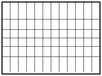 |Miller|圆柱投影，任意墨卡托投影；既不是等面积，也不是保形。|
| 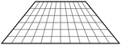 |Trapezoidal, Donis|伪圆柱，经线是直线，有时在赤道上对称地断开|
| 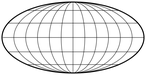 |Mollweide, elliptical, Babinet, homolographic, homalographic| 伪圆柱，等面积，经线为椭圆；全图以2：1的椭圆为界；有时会中断；变化包括亚特兰蒂斯和布罗姆利 |
| 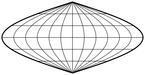 |Sanson-Flamsteed, sinusoidal, Mercator equal-area	|伪圆柱，等面积，经线为正弦，纬线为等距和标准线；2 : 1|
| 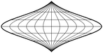 |Foucault's stereographic equivalent|伪圆柱、等面积、平行线的间隔就像在方位立体图的赤道投影面一样|
| 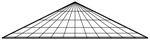 |Collignon|伪圆柱，等面积，经线是直线。两种主要的变体，有三角形框架或对称的钻石，经线在赤道处断开|
| 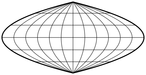 |Craster parabolic|伪圆柱，等面积，经线是抛物线. 与Putniņš's P4一样|
| 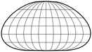 |Loximuthal|伪圆柱，所有通过中央子午线和参考纬线的交点的直线都是具有正确比例和方位角的等角航线。通常在赤道周围是不对称的|
| 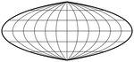 |Quartic authalic|伪圆柱，等面积，经线是4阶多项式；哈默和埃克特-格里芬多夫的极限情况|
| 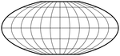 |Flat polar quartic| 伪圆柱，等面积，极线是赤道的三分之一 |
| 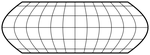 |Nell's pseudocylindrical|伪圆柱，等面积，极线|
| 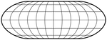 |Nell-Hammer|伪圆柱，等面积，极线|
| 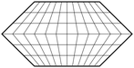 |Eckert I|伪圆柱, 2 : 1, 极线是赤道的二分之一, 经线是在赤道处断开的直线。纬线等间距|
| 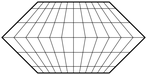 |Eckert II|伪圆柱，等面积, 2 : 1, 极线是赤道的二分之一,  经线是在赤道处断开的直线|
| 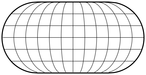 |Eckert III|伪圆柱, 2 : 1, meridians are elliptical arcs (boundary is circular). Parallels are equally spaced.|
| 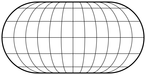 |Eckert IV|伪圆柱，等面积, 2 : 1, 经线是椭圆弧(边界是圆形)。纬线等间距。|
| 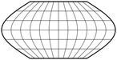 |Eckert V|伪圆柱, 2 : 1, 经线是正弦曲线，纬线是等间距的。温克尔第一投影的特例|
| 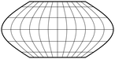 |Eckert VI|伪圆柱, 等面积, 2 : 1, 极线是赤道的二分之一, 经线是正弦曲线|
| 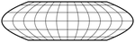 |Rosén's pseudocylindrical|伪圆柱, 等面积, 基于正弦投影:极点映射到基础投影的纬线反正弦(0.8) N和S|
| 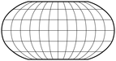 |Robinson, orthophanic|伪圆柱, 任意投影. 既不共形也不等面积|
| 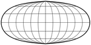 |Kavrayskiy V|伪圆柱, 等面积|
| 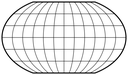 |Kavrayskiy VII|伪圆柱, 任意投影, 椭圆经线|
| 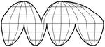 |Goode homolosine|伪圆柱, 等面积, 混合加入Mollweide在两极，Sanson-Flamsteed在赤道带，几乎总是用的分瓣投影|
| 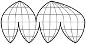 |Boggs eumorphic|伪圆柱, 等面积, Mollweide和Sanson-Flamsteed投影的算术平均值,通常用分瓣投影|
| 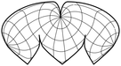 |Sinu-Mollweide|伪圆柱, 等面积, Mollweide和(下部)Sanson-Flamsteed投影的混合融合。通常是倾斜的和中断的|
| 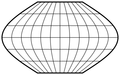 |Winkel I|伪圆柱(埃克特V的推广)，平均桑森-弗兰斯蒂德和等距圆柱，子午线是正弦曲线|
| 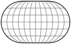 |Winkel II|伪圆柱，平均等距圆柱形和一个修改的椭圆投影|
| 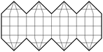 |HEALPix|伪圆柱, 等面积,兰伯特等面积圆柱投影和间断柯里侬投影的混合；设计用于FITS网格中天文和宇宙数据的栅格处理。|
| 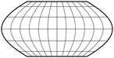 |Pseudo-Eckert|伪圆柱, 等面积 经线是部分正弦曲线|
| 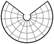 |Perspective (orthographic, stereographic or centrographic) conic	|圆锥，真实透视。由默多克和科利斯使用|
| 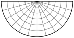 |Equidistant conic|圆锥，恒定经线比例；极限情况是方位等距和圆柱等距投影。施杰宁I投影的一般情况。有许多变化，主要是标准纬线的选择(Murdock，Euler)；其他的包括德勒岛的圆锥投影|
| 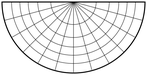 |Braun's stereographic conic|投影中心在极点的透视圆锥投影，标准纬度为30°。|
|  |Albers equal-area conic|圆锥, 等面积;极限情况是兰伯特等积圆锥和圆柱投影|
|  |Lambert's equal-area conic, isospherical stenoteric|圆锥, 等面积;是以极点为标准纬线的阿尔伯特圆锥投影的极限情况|
|  |Lambert's conformal conic, orthomorphic conic|圆锥，共形；极限情况是方位立体投影和墨卡托投影|
|  |Polyconic, American Polyconic| 多圆锥，纬线是具有正确比例的非同心圆弧。既不共形也不等面积 |
|  |Rectangular Polyconic, War Office| 多圆锥形，纬线是以直角穿过所有经线的非同心圆弧；赤道或两条纬线的长度是正确的。既不是等面积也不是共形 |
|  |Wiechel| 伪方位；修改后的方位等面积投影，不再是方位投影。只有在极地投影面时才有意义，经线是具有标准比例的圆弧。通常被剪成一个半球。 |
|  |Aitoff|修改后的赤道方位角等距投影的拉伸；边界是2：1的椭圆；既不等面积，也不保形。|
|  |Hammer, Hammer-Aitoff, Aitoff-Hammer|由方位等面积赤道图修改而来；等面积，边界为2 : 1椭圆；变化包括Briesemeister，海洋和北欧|
|  |Briesemeister|重新缩放的斜轴 Hammer 投影. 等面积|
|  |Eckert-Greifendorff|与 Hammer 投影类似, 具有不同的缩放比例系数，因此纬线几乎是平行直线,等面积|
|  |Schjerning II (original map includes an arbitrary unspecified enlargement)| 方位角等距内半球。外半球形成一个2:1的椭圆。从地图中心的距离正确，方位角只在内半球正确。不共形,不等面积 |
|  |Schjerning III| 地图由连接在一点的两个圆组成。从地图中心到每一点的距离是正确的，但方位角不正确。最终地图以伦敦为中心。既不共形也不等面积 |
|  |Wagner IX, Aitoff-Wagner|Aitoff 投影的修正; 既不共形也不等面积|
|  |Winkel Tripel| 艾托夫投影和等距圆柱投影的算术平均值。既不是等面积也不是共形 |
|  |Stabius-Werner I| 伪圆锥，等面积，纬线是以极点为中心的等距圆弧                 |
|  |Werner, Stabius-Werner II, cordiform|伪圆锥, 等面积, 纬线是等距的圆弧和标准线，以极点为中心。Schjerning IV 是斜轴；Schjerning V缩短了纬线，Schjerning VI 是分瓣的|
|  |Stabius-Werner III|伪圆锥, 等面积, 纬线是以极点为中心的等距圆弧|
|  |Bonne|伪圆锥, 等面积, 纬线是等间距的圆弧和标准线。外观取决于参考纬线。Werner 和sinusoidal的一般情况|
|  |	"Lagrange"|除了中央经线和底部纬线是直的以外，经线和纬线都是圆弧。共形，除了在极点。兰伯特发明的，是圆形的|
|  |DeLucia/Snyder's orthographic projection of Gilbert's conformal double world sphere|经纬网由椭圆弧组成。既不共形也不等面积.|
|  |Peirce Quincuncial|正方形世界地图，中央半球在中间的正方形里，除了边缘中点，共形，Guyou和Adams设计了其他投影面|
|  |Guyou|2:1的长方形世界地图，除了半球角落，共形，Peirce 和Adams 设计了其他投影面|
|  |Adams's hemispheres on squares|两个方形半球，除了角落，共形，Guyou 和Peirce设计了其他投影面|
|  |Adams's world on a square (1929)| 相反顶点的极点；沿着对角线的赤道。共形，除了四个顶点         |
|  |Adams's world on a square (1936)|相对边缘中点处的极点。保形，极点和四个顶点除外|
|  |Xarax's world in half a hexagon| 四面体上李氏映射的三叶重排。保形，除了三条最长边的中点       |
|  |Eisenlohr| 完全共形，无奇点。沿边界缩放常数。保形设计的最佳比例变形范围 |
|  |August, August epicycloidal| 处处共形，无奇点。由外摆线界定的地图。Spilhaus的一些海洋地图的基础 |
|  |Van der Grinten, Van der Grinten I| 边界是圆，经线和纬线是圆弧，除了中央经线和赤道。不保形，远离赤道大面积畸变。 |
|  |Van der Grinten II| 边界是圆，经线和纬线是直角相交的圆弧；中央经线和赤道为直线。既不是等面积也不是共形 |
|  |Van der Grinten III| 边界是圆，经线是圆弧；直的水平纬线与直的中央经线在相同的点相交，如范德格林顿I。不共形或不等面积 |
|  |Van der Grinten IV| 以两个相交的圆为界，经线是沿赤道等距分布的圆弧，纬线是圆弧。既不共形也不等面积 |
|  |Maurer's full-globular|沿范德格林顿IV线的经线，外部经线由半限制圆界定。纬线是圆弧，在外子午线和赤道上等距分布|
|  |Bacon's globular| 由一个圆界定的单个半球。圆形经线；沿着半球边界等距的水平纬线。既不共形也不等面积 |
|  |Apian's first globular| 由一个圆界定的单个半球。圆形经线；沿中央经线等距的水平纬线。既不共形也不等面积。由吕斯和阿格涅斯扩展 |
|  |Apian's second globular| 由一个圆界定的单个半球。椭圆形经线；沿中央经线等距的水平纬线。既不共形也不等面积 |
|  |Fournier's first globular| 由一个圆界定的单个半球。椭圆形经线；圆形纬线。既不共形也不等面积 |
|  |Fournier's second globular| 由一个圆围成的单个半球。椭圆形经线；直纬线。既不共形也不等面积 |
|  |Globular, "Nicolosi" globular|由一个圆界定的单个半球。圆形纬线和经线。既不共形也不等面积。也是La Hire和al-Biruni所为|
|  |Ortelius's oval| 阿皮安第一球状半球的简单延伸。既不是伪圆柱形、等面积也不是共形的 |
|  |Leonardo da Vinci's octant map| 八分图，以圆弧为界；网格不确定，可能既不共形也不等面积       |
|  |Jäger star| 仅由直线组成的经纬网。八个不相等的裂片，每个在核心和外半球对称。平行线在每个波瓣中线性间隔。既不共形也不等面积 |
|  |Petermann star| 纬线是同心的、等距的圆弧，经线是直线(大部分在赤道处断开)。既不共形也不等面积。有时描述为不相等的分瓣 |
|  |Berghaus star| Petermann's 投影的五瓣版本                                   |
|  |Maurer's S233| 经纬网由具有恒定间距的直线组成。既不共形也不等面积。耶格尔投影的对称情况 |
|  |Maurer's S231 (equal-area star)| 纬线是圆的同心弧；中央半球是朗伯方位图。分瓣的经线是弯曲的。等面积 |
|  |William-Olsson| 使用重新缩放的Werner投影将部分内半球中的Lambert方位角投影与波瓣相结合。等面积 |
|  |Bartholomew's "Tetrahedral"|核心是一个部分方位角等距半球。分瓣是放大了纬线比例尺的修正沃纳投影。既不共形、等面积，也不是多面体的|
|  |"Flower-petal", Daisy| 横向墨卡托分瓣；中央核心使用方位等面积投影。美国地质调查局ISIS计划的一部分 |
|  |Conoalactic| 与伯格豪斯非常相似，但中央半球是基于等距圆锥曲线的；不要与卡西尔的“蝴蝶”地图混淆 |
|  |Armadillo (orthoapsidal on torus)| 中间投影面是半径为1和1的圆环面；最终地图被正射投影；既不是等面积也不是共形 |
|  |Orthoapsidal on ellipsoid| 中间投影面是椭球面；极点可以是点或线，子午线可以有选择地具有恒定的尺度；最终的地图被正射投影 |
|  |Arden-Close| 等面积圆柱图及其横面的算术平均值；既不是等面积也不是共形的   |
|  |Tobler's projection for local maps|用于小区域的快速渲染。既不是等面积也不是共形的。参考纬线参数化|
|  |Gringorten's projection| 正方形的等面积                                               |
|  |Lee's map on a regular tetrahedron| 除四面体顶点外的共形                                         |
|  |COBE Quadrilaterized Spherical Cube| 立方的，面积大致相等。用于宇宙的宇宙学图表，而不是地球地理   |
|  |Quadrilaterized Spherical Cube| 立方的，等面积的。COBE QSC的改装                             |
|  |Fuller's Dymaxion™ projection on cuboctahedron| 沿面边保留比例。既不是等面积也不是共形的。几种可能的表面布置 |
|  |Fuller's Dymaxion™ Air-Ocean World Map on an icosahedron| 沿面边保留比例。既不是等面积也不是共形的。几种可能的表面布置 |
|  |Gnomonic projection on polyhedra; adopted by several authors, notably Irving Fisher on the icosahedron and Cahill on octahedra| 与普通日晷相同，具有分瓣的优点和缺点，加上任意的分瓣排列     |
|  |Fisher's equal-area projection on the icosahedron.| 等面积。Snyder对其他正多面体的推广                           |
|  |Cahill's Butterfly| 在正八面体上发展起来的。基本投影是日晷投影；变体是等面积的或共形的。由吉恩·凯斯进一步完善 |
|  |Steve Waterman's projection system| 基于由填充球体的中心定义的截顶八面体。经纬网由断开的直线组成。既不共形也不等面积。 |
|  |Kent Halstead's equidistant projection| 沿所有经线和纬线等距，这些经线和纬线被打断以减少裁切。既不共形也不等面积 |
|  |Kent Halstead's Composite World projection|分瓣的，基于兰伯特的方位投影。除了在波瓣边界，大部分等面积。|
